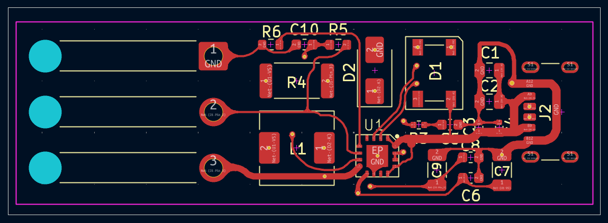
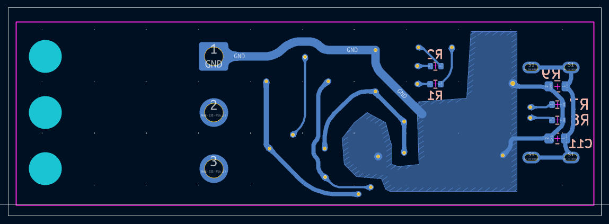

# TP5100 1S Li-Ion Battery Charger (V1 — KiCad Learning Design)

[](https://www.kicad.org/)
[](#)
[](#)

A dedicated switch-mode lithium-ion battery charging board based on the **TP5100** synchronous step-down charging management IC, designed in KiCad with full production Gerbers and documentation.

> [!NOTE]
> **Project Context (V1 Learning Design)**  
> This board was designed in November 2025 as one of the author's very first PCB designs to learn KiCad—mastering schematic capture, custom footprint creation, and PCB trace routing.  
> 
> A subsequent ultra-compact redesign is available: [**TP5100 Micro Charging Module (V2)**](https://github.com/koko69420/TP5100-Charging-Module), which achieves a **66% footprint reduction** (down to 20.0 mm × 16.5 mm) with 1S/2S selectable charging.

---

## 3D Renders

| Top View | Bottom View |
| :---: | :---: |
|  |  |

---

## Evolution & Version Comparison

| Parameter | V1: KiCad Learning Board (This Repo) | [V2: Micro Module Redesign](https://github.com/koko69420/TP5100-Charging-Module) |
| :--- | :--- | :--- |
| **Role & Context** | Initial design created to learn KiCad | Ultra-compact miniaturized redesign |
| **Board Dimensions** | **55.5 mm × 17.6 mm** (977 mm²) | **20.0 mm × 16.5 mm** (330 mm²) — *66% smaller* |
| **Edge Geometry** | Standard rectangular (90° corners) | Chamfered / rounded corner arcs |
| **Battery Topology** | 1S dedicated (4.2V) | 1S (4.2V) / 2S (8.4V) solder-jumper selectable |
| **Max Charge Current** | Up to 2.0 A | Up to 2.0 A |
| **Input Supply** | 5.0 V – 18.0 V DC | 5.0 V – 18.0 V DC |
| **Component Density** | Spacious layout for easy hand-assembly | High-density double-sided SMD placement |
| **Thermal Strategy** | Distributed copper pours | Thermal relief via stitching under IC |

---

## Features

- **High-Efficiency Switch-Mode Charging**:
  - Utilizes the TP5100 buck switching management IC operating at high frequency (up to 2A charge current).
  - Superior thermal performance and energy efficiency compared to linear chargers (such as the TP4056).
- **1S Lithium-Ion Cell Profile**:
  - Configured for single-cell 4.2V float voltage charging.
  - Multi-stage Constant Current (CC) / Constant Voltage (CV) charging with trickle pre-charging for over-discharged cells.
- **Protection & Monitoring**:
  - Dual LED charging status indicators (Charging / Standby & Complete).
  - Input over-voltage and thermal shutdown protection.
- **Manufacturing-Ready Production Files**:
  - Pre-generated RS-274X Gerber layers and Excellon NC drill files ready for standard PCB fabrication.

---

## Hardware Specification

| Parameter | Value | Unit |
| :--- | :--- | :--- |
| **Charger Controller** | TP5100 | — |
| **Input Voltage Range** | 5.0 – 18.0 | V DC |
| **Battery Configuration** | 1S (1 Cell) | — |
| **Float Voltage** | 4.2 | V |
| **Charge Current** | Configurable up to 2.0 | A |
| **Architecture** | Synchronous Buck Switching | — |
| **PCB Form Factor** | 55.5 mm × 17.6 mm (2-Layer FR4, 1.6 mm thickness, 1 oz copper) | — |

---

## Project Structure

```text
TP5100-1S-Charger/
├── Schematic.pdf                     # Complete electrical schematic
├── front.png                         # 3D PCB front render
├── back.png                          # 3D PCB back render
├── why.txt                           # Project inception note ("Learning KiCad")
├── TP5100_1S_Charger.kicad_sch       # KiCad schematic design
├── TP5100_1S_Charger.kicad_pcb       # KiCad PCB board layout
├── TP5100_1S_Charger.kicad_pro       # KiCad project file
├── TP5100_1S_Charger-F_Cu.gbr        # Top copper layer
├── TP5100_1S_Charger-B_Cu.gbr        # Bottom copper layer
├── TP5100_1S_Charger-F_Mask.gbr      # Top solder mask
├── TP5100_1S_Charger-B_Mask.gbr      # Bottom solder mask
├── TP5100_1S_Charger-F_Silkscreen.gbr# Top silkscreen
├── TP5100_1S_Charger-B_Silkscreen.gbr# Bottom silkscreen
├── TP5100_1S_Charger-Edge_Cuts.gbr   # Board contour outline
├── TP5100_1S_Charger-PTH.drl         # Plated through-hole drill file
├── TP5100_1S_Charger-NPTH.drl        # Non-plated through-hole drill file
├── .gitignore                        # Git ignore rules
└── README.md                         # Project documentation
```

---

## License

Open hardware design. All rights reserved by Kausthubh Viswanath.
